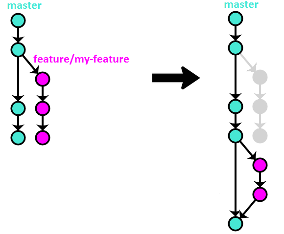

# Workflow

See also in : 
 - [French](README-fr.md)

# Table of contents 

- [GIT](#git)
  - [Branching strategy](#branching-strategy)
    - [Feature branches](#feature-branches)
    - [Release branches](#release-branches)
    - [Hotfix branches](#hotfix)
  - [Commit messages](#commit-messages)
    - [Structure](#structure)
    - [Type](#type)
    - [Description](#description)
    - [Body](#body)
    - [Footer](#footer)
    - [Examples](#examples)
  - [Versionning](#versionning)
    - [MAJOR](#major)
    - [MINOR](#minor) 
    - [PATCH](#patch)

- [TEMPLATES](#templates)
  - [Issues template](#issues-template)
  - [Pull requests template](#pull-requests-template)


# Git

## Branching strategy

We are using [OneFlow](https://www.endoflineblog.com/oneflow-a-git-branching-model-and-workflow) as Git strategy.
OneFlow is based on GitFlow, but uses only one eternal branch (here `main`).

### Feature branches

Working on a new feature needs to be done on an other branch, named `feature/<my-feature>`.
Feature branches only exist in the local repository.
If there are multiple people working on it, or to be sure to not loose
some work, the branch can be pulled on the remote repository.

Feature branches are created like this:
```
git checkout -b feature/<my-feature> main
```

Push the branch on the remote one if needed:
```
git push -u origin feature/<my-feature>
```
Once work on the feature is done, and when the feature is stable, it 
needs to be integrated in `main` like this:
```
git checkout feature/<my-feature>
git rebase -i main
git checkout main
git merge --no-ff feature/<my-feature>
git push
git branch -d feature/<my-feature>
```

Visually:

If the branch was pushed to the remote:
```
git push origin :feature/<my-feature>
```

Notes: Of course we can commit on `main`, but you must avoid doing it. 

### Feature branches

Release branches are created to prepare the software for being released.

Note on the release number: we are using schemantic versionning, see
[versionning](). 

Starting the branch:
```
git checkout -b release/<version-number> <commit-hash>
```
Notes: release branches don't necessarily start from the actual state 
of `main`, hence the presence of `<commit-hash>`.

When the new version can be released, the branch can be added on the
top of `main`:
```
git checkout release/<release-number>
git tag <version-number>
git checkout main
git merge release/<version-number>
git push --tags
git branch -d release/<version-number>
```
Visually:


If the branch was pushed to the remote:
```
git push origin :release/<version-number>
```

### Hotfix

Hotfix branches are really similar to release branches and they only
differ in their attentions: one is planed, and the other is not 
planed but needed to fix some critical defect in the lastest
release.

Starting the branch:
```
git checkout -b hotfix/<version-number> <version-number-to-fix>
```

If we want to push the branch:
```
git push -u origin hotfix/<version-number>
```

Once all has been fixed, the branch can be pushed:
```
git checkout hotfix/<version-number>
git tag <version-number>
git checkout main
git merge hotfix/<version-number>
git push --tags
git branch -d hotfix/<version-number>
```

Visually:
 

If the branch was pushed: 
```
git push origin :hotfix/<version-number>
```

## Commit messages

To name commits, we were inspired by [Conventional Commits](https://www.conventionalcommits.org/en/v1.0.0/).

### Syntax

The commit's is composed of 4 parts:
```
<type>: <description>

[body]

[footer]
```

### Type

There are 5 differents types of commits:

 1. **feat**: A commit of the type `feat` introduces a new feature in 
 the codebase.

 2. **fix**: A commit of the type `fix` patches a bug in the codebase.

 3. **style**: A commit of the type `style` changes an element 
 related to the style in the codebase.

 4. **docs**: A commit of the type `docs` adds/modifies an element of 
 the documentation.

 5. **revert**: A commit of the type `revert` reverts a previous
 commit.

### Description 

A good description begins with a capital letter, and doesn't end with
a period. It needs to be written in English and uses the imperative
mood. The subject line should be limited to 50 characters. If the 
description is formulated correctly, it should be able to complete
this sentence : *This commit will...* 

Some verbs examples:
 - Add
 - Remove
 - Create
 - Fix 
 - Release 
 - Modify
 - Update
 - etc

### Body 

The body needs to be warped at 72 characters. It needs to explain
what changed and why.

### Footer 

The footer contains the issue related (`Resolve: #123`), and/or the 
hesh of the commit in a `revert` (`Revert: 9efc5d`). It also contains the name of the people how review a pull request (`Reviewed-by: Someone`).

### Examples

```
fix: Prevent racing of requests

Introduce a request id and a reference to latest request. Dismiss
incoming responses other than from latest request.

Remove timeouts which were used to mitigate the racing issue but are
obsolete now.

Reviewed-by: Z
Resolve: #123
```

## Versionning

For the versionning, we are currently based on [Semantic Versionning](https://semver.org/).

### MAJOR

This number is not changed manually.

### MINOR

This number is updated on each merge of a new feature into `main`.

### PATCH

This number is updated on each merge of a hotfix into `main`.

# Templates

## Issues template
```
**Note: for support questions, please ask on the Discord**. This repository's issues are reserved for feature requests and bug reports.

* **I'm submitting a ...**
  - [ ] bug report
  - [ ] feature request
  - [ ] support request => Please do not submit support request here, see note at the top of this template.


* **What do you want to request or report?**


* **What is the current behavior?**


* **If the current behavior is a bug, please provide the steps to reproduce.**


* **What is the expected behavior?**


* **What is the motivation / use case for changing the behavior?**


* **Please tell us about your environment:**
  
  - Version: 1.x.x-abc
  - Python version: 


* **Other information** (e.g. detailed explanation, stacktraces, related issues, suggestions how to fix, links for us to have context, eg. stackoverflow, gitter, etc)

```

## Pull requests template
```
**Please check if the PR fulfills these requirements**
- [ ] A similar PR is not already submitted
- [ ] Commit message(s) and branch name follows our guidelines
- [ ] Tests for the changes have been added (for bug fixes / features)
- [ ] Docs have been added / updated (for bug fixes / features)


**What kind of change does this PR introduce?** (Bug fix, feature, docs update, ...)


**What is the current behavior?** (You can also link to an open issue here)


**What is the new behavior (if this is a feature change)?**


**Other information** (e.g. system tested on, etc)

```
